# Caso AbogaBot

Es un despacho de abogados que quiere automatizar las demandas de sus clientes, esto lo harán a traves de una página web llenando un formulario.
Utilice los Softwares Figma y Miro para crear los recursos graficos.

## **1. Toma de requerimentos.**

* ## Administrador
     * Como Administrador requiere `recibir, ver, listar y actualizar` las notificaciones de demandas de los clientes.
     * Al recibir la notificación se deberá crear automáticamente el documento legal en formato Word con los datos enviados al formulario.
     * Se deberá poder actualizar el estado de la demanda y agregar comentarios en cada actualización.
     * Estos pagos se deberán mostrar en un Dashboard para análisis de ingresos recibidos.

* ## Cliente
    * Como Cliente requiere poder `registrar` su información de demanda en un formulario bien definido y estructurado.
    * Como Cliente requiere poder `pagar` su pedido en el aplicativo web de forma segura.
    * Como Cliente requiere poder `ver y listar` las actualizaciones de su proceso legal (pedido/solicitud).
    * Como Usuario requiere tener una `página responsive` para poder verla desde diferentes pantallas/dispositivos.
    * Como Usuario requiere poder `registrar` una cuenta de usuario o `conectarse` en caso de que ya tenga una en la plataforma web.

* ## Diagrama de Flujo: (https://miro.com/es/)

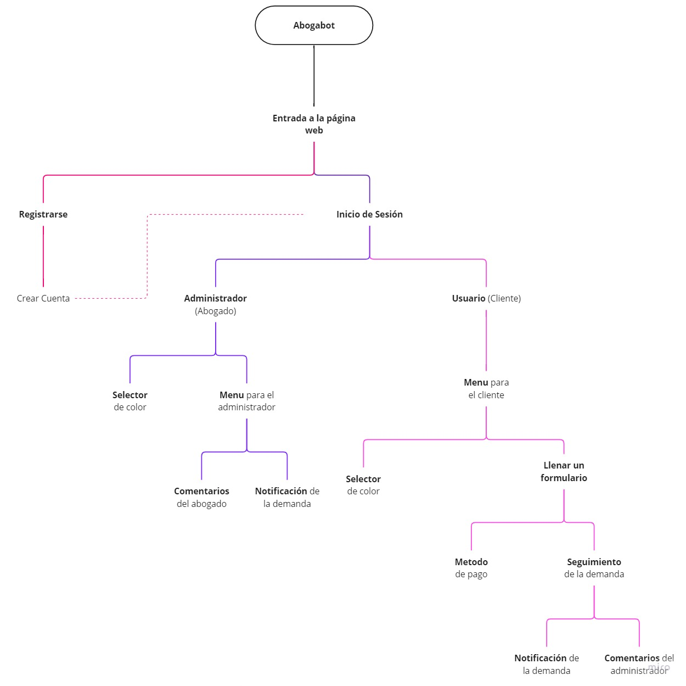 

## **2. Buyer Persona: (https://www.figma.com/)**

Para este ejemplo del Buffet de abogados, nuestro cliente ideal del proyecto, se representa como un abogado jefe de la firma de abogados asociados.

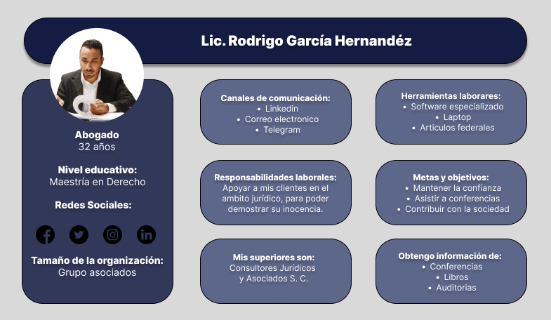 

## **3. Publico Objetivo: (https://www.figma.com/)**

En esta parte se muestra una diapositiva sobre nuestros posibles clientes objetivos.

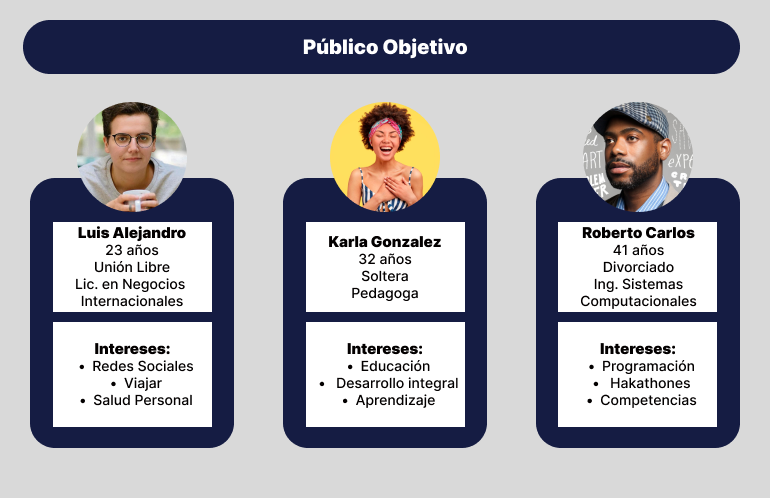 

## **4. UI.(https://www.figma.com/)**

Para el Wireframe, se tomo en cuenta los colores Azul Marino y Blanco, pero ademas se agregaron los colores Violeta y Azul Cielo para un mejor contraste; Además para tener mejor comodidad, se hizo la maquetación desde una perspectiva de un telefono movil, esto es debido a que la mayoria del publico objetivo accedería desde un telefono movil. La mejor forma de presentar esta parte estara dividido en 3 partes; Primero mostrare el Inicio de Sesión:

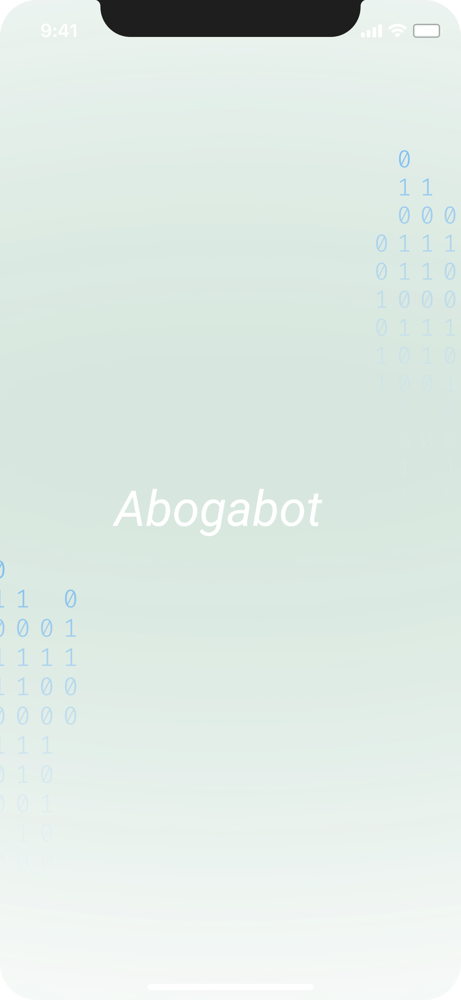 
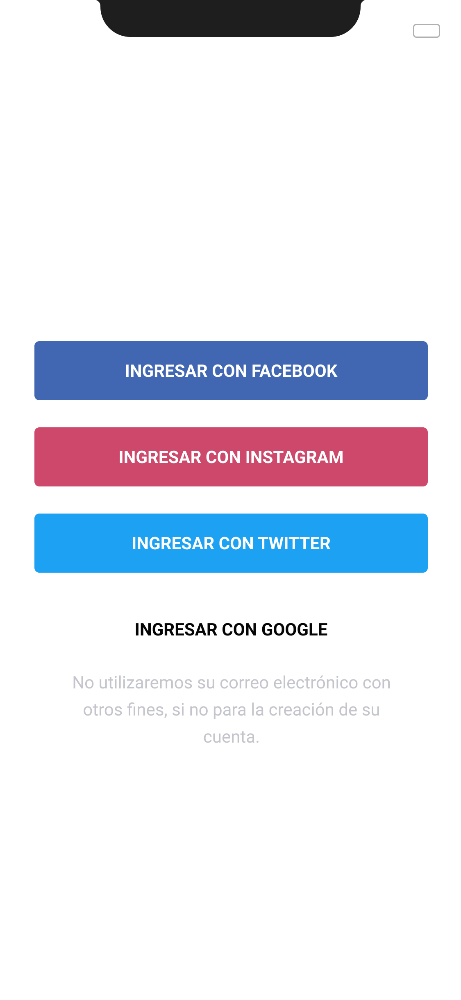 
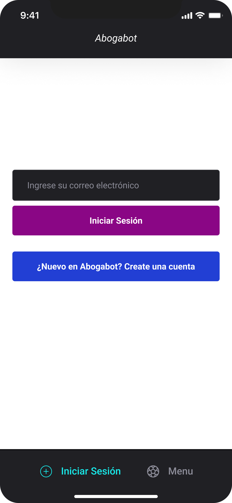 
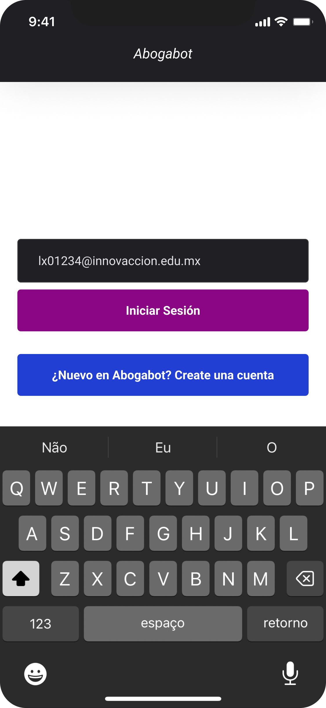 
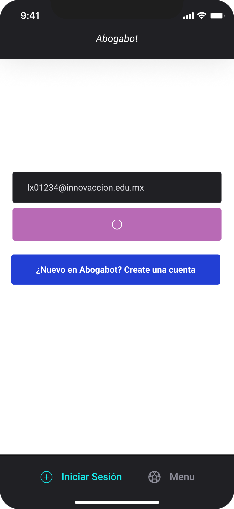 

Para la segunda parte se mostrada el Dashboard:

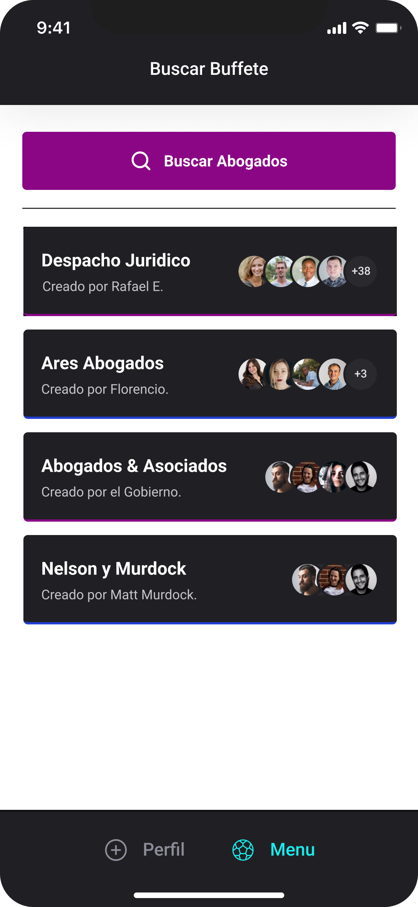 
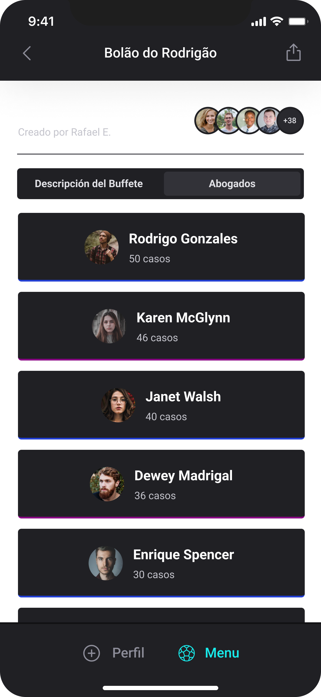 
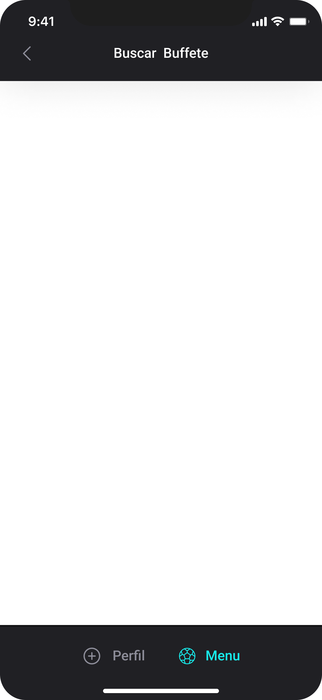 
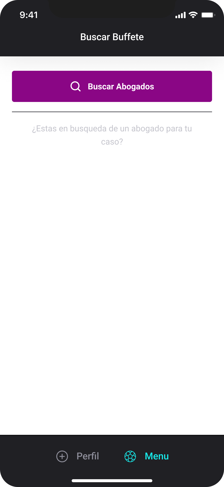 

Para la tercera y ultima parte mostrare el Metodo de pago:

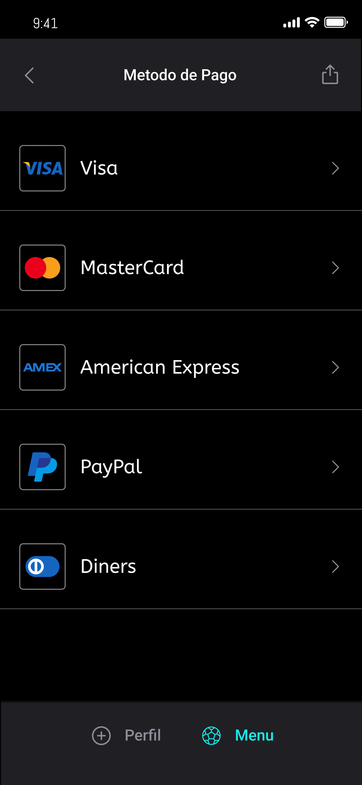 
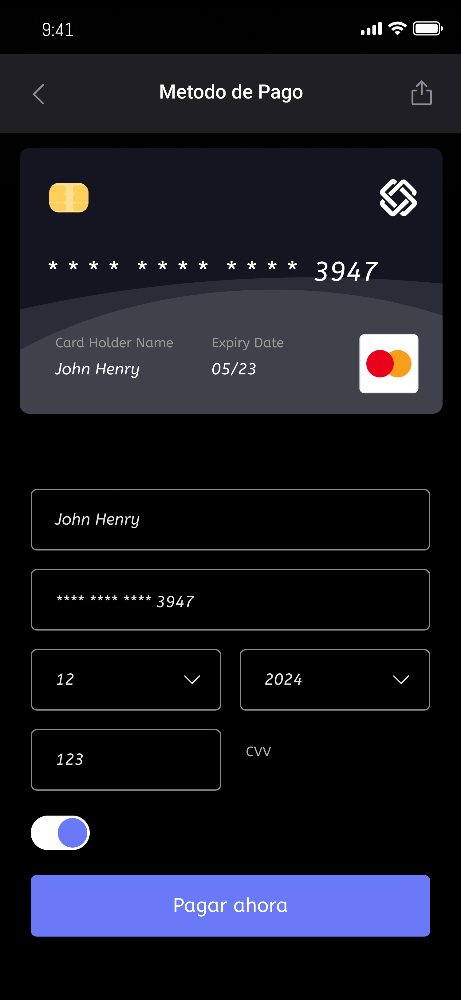 
